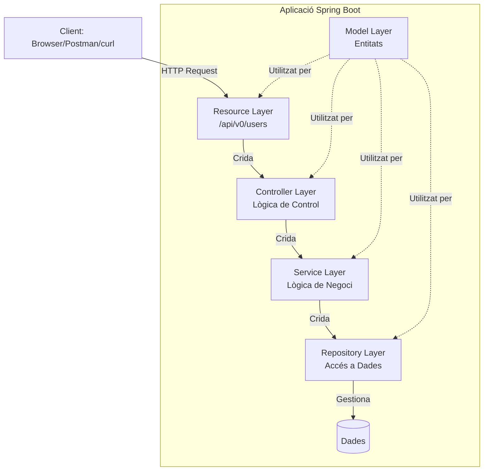
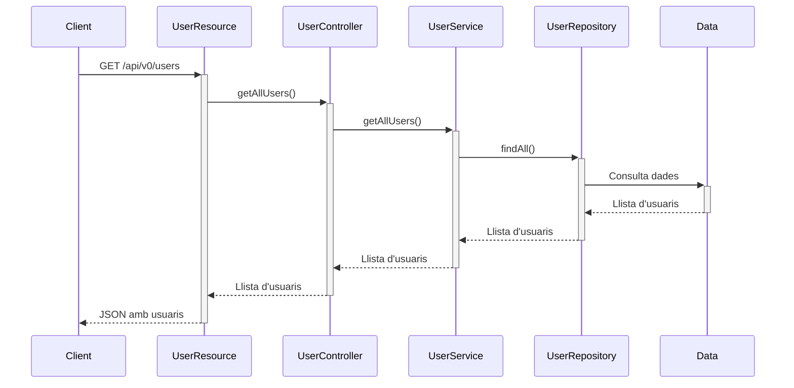
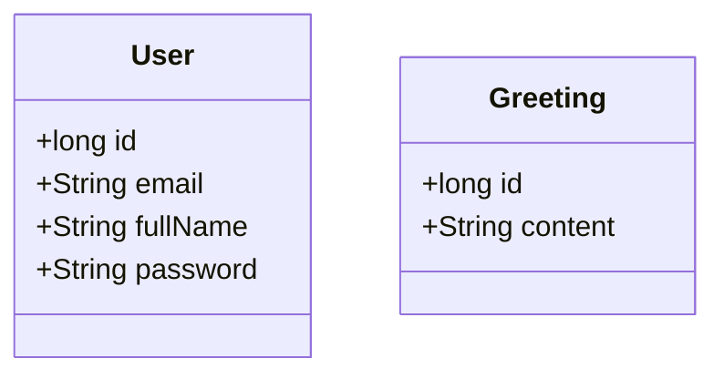
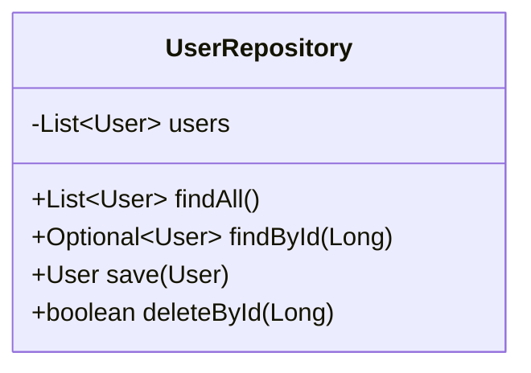
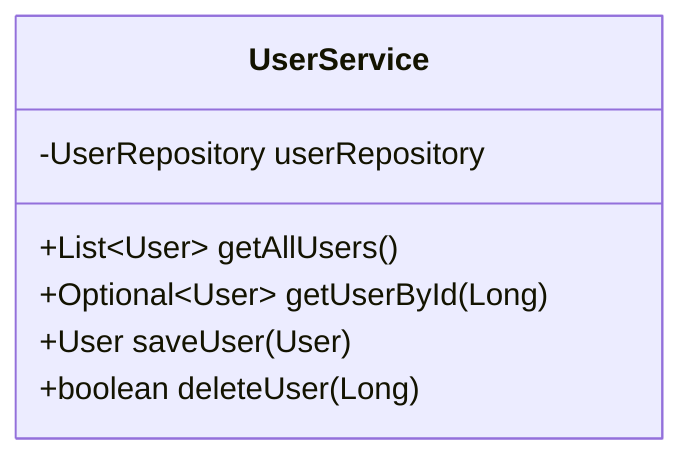
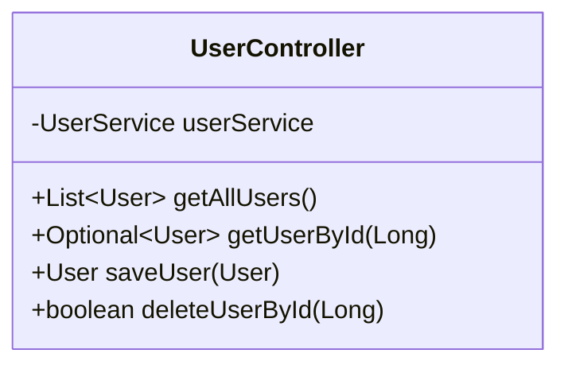
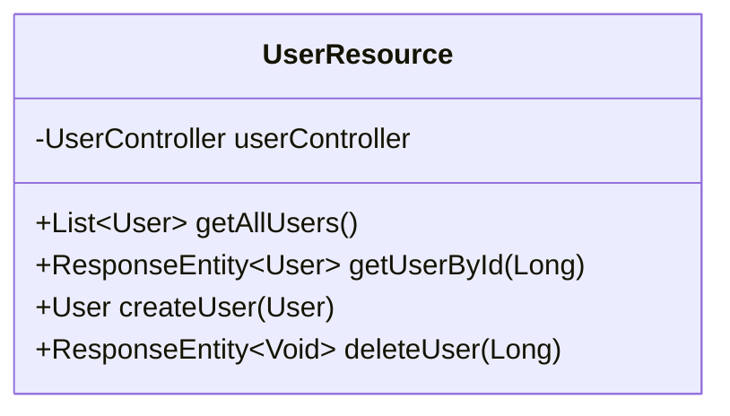
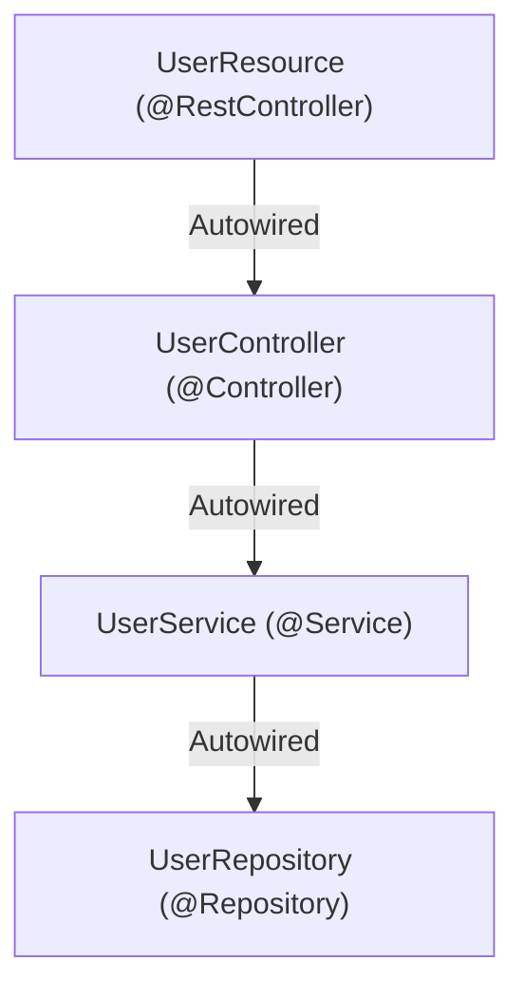

# Servei RESTful amb Spring Boot - Gestió d'Usuaris

Aquest projecte implementa un servei RESTful bàsic per a la gestió d'usuaris utilitzant Spring Boot. El projecte demostra l'arquitectura en capes i les operacions CRUD bàsiques (Crear, Llegir, Actualitzar, Eliminar).

## Índex

1. [Estructura del Projecte](#estructura-del-projecte)
2. [Configuració i Execució](#configuració-i-execució)
3. [Components del Projecte](#components-del-projecte)
    - [Model](#model)
    - [Repositori](#repositori)
    - [Servei](#servei)
    - [Controlador](#controlador)
    - [Recurs REST](#recurs-rest)
4. [Endpoints de l'API](#endpoints-de-lapi)
5. [Com Provar l'API](#com-provar-lapi)
    - [Utilitzant curl](#utilitzant-curl)
    - [Utilitzant Postman](#utilitzant-postman)
6. [Conceptes Clau](#conceptes-clau)
7. [Anotacions de Spring Boot](#anotacions-de-spring-boot)

## Estructura del Projecte

```
src/main/java/net/elpuig/springbootrestfulwebservicebasics/
│
├── model/                  // Classes per a representació de dades
│   ├── Greeting.java      // Model per a la demostració inicial
│   └── User.java          // Model principal d'usuari
│
├── repository/             // Capa d'accés a dades
│   └── UserRepository.java
│
├── service/                // Capa de lògica de negoci
│   └── UserService.java
│
├── controller/             // Capa de controlador
│   ├── GreetingController.java  // Controlador de demostració
│   └── UserController.java      // Controlador principal
│
├── resource/               // Capa d'API REST
│   └── UserResource.java   // Endpoints de l'API REST
│
└── SpringBootRestfulWebServiceBasicsApplication.java  // Classe principal
```

## Configuració i Execució

### Requisits previs
- Java 17 o superior
- Gradle o Maven

### Per executar l'aplicació
```bash
# Amb Maven
./mvnw spring-boot:run

# Amb Gradle
./gradlew bootRun
```

Una vegada iniciada, l'aplicació estarà disponible a:
- http://localhost:8080

## Components del Projecte

### Model

#### Greeting.java

```java
public record Greeting(long id, String content) {
}
```

Aquest és un "record" de Java (introduït a Java 14) que representa una salutació.

**Què és un record?**
- Una classe immutable (els seus valors no poden canviar després de creada)
- El compilador genera automàticament:
    - Constructor
    - Mètodes d'accés (getters): `id()` i `content()`
    - Mètodes `equals()`, `hashCode()` i `toString()`

#### User.java

```java
public record User(long id, String email, String fullName, String password) {
}
```

Aquest record representa un usuari amb:
- `id`: Identificador únic
- `email`: Correu electrònic
- `fullName`: Nom complet
- `password`: Contrasenya

**Nota**: En una aplicació real, la contrasenya hauria d'estar encriptada i no exposada directament en un JSON.

### Repositori

#### UserRepository.java

```java
@Repository
public class UserRepository {
    private final List<User> users = new ArrayList<>();
    
    // Constructor amb dades d'exemple
    public UserRepository() {
        users.add(new User(1L, "user1@exemple.com", "User One", "password1"));
        users.add(new User(2L, "user2@exemple.com", "User Two", "password2"));
        users.add(new User(3L, "user3@exemple.com", "User Three", "password3"));
    }
    
    // Mètodes CRUD...
}
```

El repositori és la capa que interactua amb les dades. En aquest exemple, utilitzem una llista en memòria, però en una aplicació real podria ser una base de dades.

**Mètodes principals**:

- `findAll()`: Retorna tots els usuaris
- `findById(Long id)`: Busca un usuari per ID
- `save(User user)`: Guarda un usuari nou o actualitza un d'existent
- `deleteById(Long id)`: Elimina un usuari per ID

**Stream API**: El mètode `findById` utilitza la API de Stream de Java:
```java
return users.stream()
        .filter(user -> user.id() == id)
        .findFirst();
```
Això filtra la llista d'usuaris per trobar el primer que coincideixi amb l'ID especificat.

### Servei

#### UserService.java

```java
@Service
public class UserService {
    private final UserRepository userRepository;
    
    @Autowired
    public UserService(UserRepository userRepository) {
        this.userRepository = userRepository;
    }
    
    // Mètodes de servei...
}
```

La capa de servei implementa la lògica de negoci i actua com a intermediari entre el controlador i el repositori.

**Mètodes principals**:

- `getAllUsers()`: Obté tots els usuaris
- `getUserById(Long id)`: Obté un usuari per ID
- `saveUser(User user)`: Guarda o actualitza un usuari
- `deleteUser(long id)`: Elimina un usuari

### Controlador

#### GreetingController.java

```java
@RestController
@RequestMapping(GreetingController.GREETING_CONTROLLER)
public class GreetingController {
    public static final String GREETING_CONTROLLER = "/greeting";
    
    private static final String template = "Hello, %s!";
    private final AtomicLong counter = new AtomicLong();
    
    @GetMapping
    public Greeting greeting(@RequestParam(value = "name", defaultValue = "World") String name) {
        return new Greeting(counter.incrementAndGet(), String.format(template, name));
    }
}
```

Aquest controlador demostra un servei RESTful bàsic de salutació.

**Elements clau**:

- `AtomicLong counter`: Un comptador segur per a entorns multifil (concurrent)
- `String.format(template, name)`: Formata un missatge amb el nom proporcionat

#### UserController.java

```java
@Controller
public class UserController {
    private final UserService userService;
    
    @Autowired
    public UserController(UserService userService) {
        this.userService = userService;
    }
    
    // Mètodes del controlador...
}
```

Aquest controlador implementa la lògica de l'aplicació per a la gestió d'usuaris.

**Mètodes principals**:

- `getAllUsers()`: Obté tots els usuaris
- `getUserById(Long id)`: Obté un usuari per ID
- `saveUSer(User user)`: Guarda o actualitza un usuari
- `deleteUserById(Long id)`: Elimina un usuari

### Recurs REST

#### UserResource.java

```java
@RestController
@RequestMapping("/api/v0/users")
public class UserResource {
    private final UserController userController;
    
    @Autowired
    public UserResource(UserController userController) {
        this.userController = userController;
    }
    
    // Endpoints REST...
}
```

Aquesta classe exposa els endpoints REST per a la gestió d'usuaris.

**Endpoints principals**:

- `GET /api/v0/users`: Obté tots els usuaris
- `GET /api/v0/users/{id}`: Obté un usuari específic
- `POST /api/v0/users`: Crea un nou usuari
- `DELETE /api/v0/users/{id}`: Elimina un usuari

## Endpoints de l'API

### 1. Obtenir tots els usuaris

```
GET /api/v0/users
```

**Resposta**:
```json
[
  {
    "id": 1,
    "email": "user1@exemple.com",
    "fullName": "User One",
    "password": "password1"
  },
  {
    "id": 2,
    "email": "user2@exemple.com",
    "fullName": "User Two",
    "password": "password2"
  },
  {
    "id": 3,
    "email": "user3@exemple.com",
    "fullName": "User Three",
    "password": "password3"
  }
]
```

### 2. Obtenir un usuari per ID

```
GET /api/v0/users/{id}
```

**Exemple**: `GET /api/v0/users/1`

**Resposta**:
```json
{
  "id": 1,
  "email": "user1@exemple.com",
  "fullName": "User One",
  "password": "password1"
}
```

### 3. Crear un nou usuari

```
POST /api/v0/users
```

**Cos de la petició** (JSON):
```json
{
  "id": 4,
  "email": "email4@email.com",
  "fullName": "User 4",
  "password": "1234"
}
```

**Resposta**:
```json
{
  "id": 4,
  "email": "email4@email.com",
  "fullName": "User 4",
  "password": "1234"
}
```

### 4. Eliminar un usuari

```
DELETE /api/v0/users/{id}
```

**Exemple**: `DELETE /api/v0/users/1`

**Resposta**:
- Èxit: Codi 204 (No Content)
- No trobat: Codi 404 (Not Found)

## Com Provar l'API

### Utilitzant curl

**curl** és una eina de línia de comandes per transferir dades mitjançant diversos protocols, inclòs HTTP.

#### 1. Obtenir tots els usuaris
```bash
curl -X GET http://localhost:8080/api/v0/users
```

#### 2. Obtenir un usuari específic
```bash
curl -X GET http://localhost:8080/api/v0/users/1
```

#### 3. Crear un nou usuari
```bash
curl -d '{"id":4, "email":"email4@email.com","fullName":"User 4","password":"1234"}' -H "Content-Type: application/json" -X POST http://localhost:8080/api/v0/users
```

**Explicació dels paràmetres**:
- `-d`: Especifica les dades a enviar (en aquest cas, un JSON amb les dades de l'usuari)
- `-H`: Estableix una capçalera HTTP (en aquest cas, especificant que el contingut és JSON)
- `-X`: Especifica el mètode HTTP a utilitzar (GET, POST, PUT, DELETE, etc.)

#### 4. Eliminar un usuari
```bash
curl -X DELETE http://localhost:8080/api/v0/users/1
```

### Utilitzant Postman

**Postman** és una aplicació gràfica que facilita la prova de serveis web.

#### Instal·lació
1. Descarrega Postman des de [www.postman.com](https://www.postman.com/downloads/)
2. Instal·la i inicia l'aplicació

#### Configuració per provar l'API
1. Crea una nova col·lecció (Collection) per organitzar les teves peticions
2. Afegeix noves peticions per a cada endpoint:

   **GET Tots els Usuaris**:
    - Mètode: GET
    - URL: http://localhost:8080/api/v0/users

   **GET Usuari per ID**:
    - Mètode: GET
    - URL: http://localhost:8080/api/v0/users/1

   **POST Nou Usuari**:
    - Mètode: POST
    - URL: http://localhost:8080/api/v0/users
    - Body: raw, JSON
   ```json
   {
     "id": 4,
     "email": "email4@email.com",
     "fullName": "User 4",
     "password": "1234"
   }
   ```

   **DELETE Usuari**:
    - Mètode: DELETE
    - URL: http://localhost:8080/api/v0/users/1

## Conceptes Clau

### Optional

`Optional<T>` és un contenidor que pot tenir o no tenir un valor. S'utilitza per representar valors que poden ser null, evitant així els `NullPointerException`.

**Exemple**:
```java
public Optional<User> getUserById(Long id) {
    return userRepository.findById(id);
}
```

**Mètodes comuns d'Optional**:
- `isPresent()`: Retorna true si hi ha un valor present
- `get()`: Obté el valor (llança una excepció si no hi ha valor)
- `orElse(T other)`: Retorna el valor si existeix, sinó retorna l'altre
- `map(Function<? super T, ? extends U> mapper)`: Transforma el valor si existeix

### ResponseEntity

`ResponseEntity<T>` representa una resposta HTTP completa, incloent-hi:
- Codi d'estat (200 OK, 404 Not Found, etc.)
- Capçaleres
- Cos de la resposta

**Exemple**:
```java
@GetMapping("/{id}")
public ResponseEntity<User> getUserById(@PathVariable Long id) {
    return userController.getUserById(id)
            .map(ResponseEntity::ok)          // Si existeix, retorna 200 OK amb l'usuari
            .orElse(ResponseEntity.notFound().build()); // Si no, retorna 404 Not Found
}
```

**Mètodes comuns de ResponseEntity**:
- `ok()`: Crea una resposta 200 OK
- `notFound().build()`: Crea una resposta 404 Not Found
- `noContent().build()`: Crea una resposta 204 No Content (èxit, però sense contingut)
- `badRequest().build()`: Crea una resposta 400 Bad Request

### @RequestBody i @PathVariable

- `@RequestBody`: Vincula el cos de la petició HTTP a un objecte Java
  ```java
  public User createUser(@RequestBody User user) {...}
  ```

- `@PathVariable`: Vincula una variable de la URL a un paràmetre del mètode
  ```java
  public ResponseEntity<User> getUserById(@PathVariable Long id) {...}
  ```

## Anotacions de Spring Boot

### @RestController
Marca una classe com a controlador on cada mètode retorna dades directament (normalment en format JSON) en lloc de vistes. Combina `@Controller` i `@ResponseBody`.

### @RequestMapping
Mapeja peticions web a mètodes específics o a una classe controladora sencera.
```java
@RequestMapping("/api/v0/users")
```

### @GetMapping, @PostMapping, @DeleteMapping
Versions especialitzades de `@RequestMapping` per a mètodes HTTP específics:
- `@GetMapping`: Per a peticions GET (obtenir dades)
- `@PostMapping`: Per a peticions POST (crear dades)
- `@DeleteMapping`: Per a peticions DELETE (eliminar dades)

### @RequestParam
Vincula un paràmetre de consulta de la URL a un paràmetre del mètode.
```java
public Greeting greeting(@RequestParam(value = "name", defaultValue = "World") String name) {...}
```

### @Repository
Marca una classe com a repositori, component especialitzat que encapsula el comportament d'emmagatzematge, recuperació i cerca.

### @Service
Marca una classe com a servei, component que conté la lògica de negoci.

### @Controller
Marca una classe com a controlador web.

### @Autowired
Injecta automàticament dependències. S'utilitza per a la injecció de dependències, un patró de disseny que permet separar la construcció d'objectes del seu ús.
```java
@Autowired
public UserController(UserService userService) {
    this.userService = userService;
}
```

### @ResponseStatus
Estableix el codi d'estat HTTP de la resposta.
```java
@PostMapping
@ResponseStatus(HttpStatus.CREATED)
public User createUser(@RequestBody User user) {...}
```

## Arquitectura del Servei RESTful

Aquest document explica l'arquitectura en capes utilitzada en el nostre servei RESTful amb Spring Boot.

### Diagrama d'Arquitectura



### Flux de Dades en una Petició



### Explicació de les Capes

#### 1. Model (Model Layer)



**Responsabilitat**: Definir l'estructura de les dades.
- Els models són simples contenidors de dades (POJOs o Records)
- No contenen lògica de negoci
- Són immutables (en el cas dels records)

#### 2. Repositori (Repository Layer)



**Responsabilitat**: Accés i manipulació de dades.
- Proporciona mètodes per a operacions CRUD
- Abstreu la font de dades (BD, memòria, API externa)
- En aplicacions reals, normalment utilitza JPA/Hibernate

#### 3. Servei (Service Layer)



**Responsabilitat**: Lògica de negoci.
- Implementa regles de negoci
- Coordina múltiples repositoris si cal
- Gestiona transaccions
- Valida dades segons regles de negoci

#### 4. Controlador (Controller Layer)



**Responsabilitat**: Lògica de control.
- Coordina les operacions de negoci
- No gestiona directament peticions HTTP (això ho fa el Resource)
- Pot implementar validacions addicionals
- Separa la lògica d'aplicació de la interfície REST

#### 5. Recurs REST (Resource Layer)



**Responsabilitat**: Interfície REST.
- Defineix els endpoints de l'API
- Mapeja peticions HTTP a mètodes
- Gestiona codis de resposta HTTP
- Converteix objectes Java a/des de JSON

### Injecció de Dependències



Spring Boot utilitza injecció de dependències per:
- Gestionar automàticament el cicle de vida dels components
- Reduir l'acoblament entre classes
- Facilitar les proves unitàries
- Centralitzar la configuració

### Avantatges de l'Arquitectura en Capes

1. **Separació de preocupacions**: Cada capa té una responsabilitat específica
2. **Mantenibilitat**: Facilita canvis en una capa sense afectar les altres
3. **Testabilitat**: Permet provar cada capa de forma aïllada
4. **Escalabilitat**: Facilita el creixement del sistema
5. **Reutilització**: Components com serveis i repositoris poden ser reutilitzats